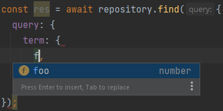

# ElasticORM


[//]: # (![Package types definitions]&#40;https://github.com/Twiddlle/elasticsearch-orm//actions/workflows/main.yml/badge.svg&#41;)

[//]: # (![Package types definitions]&#40;https://img.shields.io/github/issues-raw/Twiddlle/elasticsearch-orm&#41;)

[//]: # (![Top language]&#40;https://img.shields.io/github/languages/top/Twiddlle/elasticsearch-orm&#41;)

ElasticORM is an ORM tool that can run in javascript and helps developers
to define a mapping of entities in one place by using decorators.

---
**NOTE**

This is the very early release of this library. New features will be added soon.

---

## Installation
```shell
npm i elastic-orm @elastic/elasticsearch
```

## Usage

### 1. Entity Definition
```typescript
import { EsEntity } from 'elastic-orm/dist/decorators/EsEntity';
import { EsProperty } from 'elastic-orm/dist/decorators/EsProperty';
import { EsId } from 'elastic-orm/dist/decorators/EsId';

@EsEntity('elastic_index') // specify elastic index
export class MyEntity {
  @EsId()
  public id: string;

  @EsProperty('integer')
  public foo: number;

  @EsProperty({ type: 'keyword' })
  public bar: string;

  @EsProperty('boolean')
  public isTutorial: boolean;
}
```

### 2. Client and Repository Configuration
```typescript
import { EsRepository } from 'elastic-orm/dist/repository/EsRepository';
import { Client } from '@elastic/elasticsearch';

const repository = new EsRepository(
  MyEntity,
  new Client(/* client configuration */),
);
```
Client configuration is provided here [https://www.elastic.co/guide/en/elasticsearch/client/javascript-api/7.17/client-connecting.html](https://www.elastic.co/guide/en/elasticsearch/client/javascript-api/7.17/client-connecting.html)

### 3. Create Mapping
You can easily create index from you entity definition by running:
```typescript
import { FactoryProvider } from 'elastic-orm/dist/factory/Factory.provider';

const schema =
  FactoryProvider.makeSchemaManager().generateIndexSchema(MyEntity);
await repository.createIndex(schema);
```

### Storing and Loading
```typescript
const myEntity = new MyEntity()
myEntity.foo = 99
myEntity.bar = 'hello elastic search'
myEntity.isTutorial = true
const createdEntity = await repository.create(myEntity)
```

```typescript
const {entities, raw} = await repository.find({
  query: {
    term: {
      foo: 99,
    },
  },
})
```
- **entities** contain deserialized entities.
- **raw** contains raw response from elastic.

### Repository methods
#### Entity methods
- **create**: creates entity
- **createMultiple**: creates multiple entities
- **update**: updates entity
- **updateMultiple**: updates multiple entities
- **index**: index entity
- **indexMultiple**: index multiple entities
- **delete**: deletes entity
- **deleteMultiple**: deletes multiple entities
- **findOne**: finds single entity by specified query
- **findOneOrFail**: finds single entity or throw exception
- **find**: finds entities by query
- **findById** finds single entity by id

#### Indices/Mapping methods
- **createIndex**: creates index
- **deleteIndex**: delete index
- **updateMapping**: update mapping

#### Additional methods
- **on**: registers function on specific repository actions

## Advanced Usage

### Query
#### Native query interface
Repository requires specific elastic structure object by default.
Thanks to typescript query can be written really easily with autosuggestion.
It will hint also properties from defined entity.



#### Query Builder
If you are more familiar with builders. Bodybuilder can be used easily.
1. Install [bodybuilder](https://www.npmjs.com/package/bodybuilder) package.
```shell
npm i bodybuilder
```
2. Builder usage
```typescript
import * as bodybuilder from 'bodybuilder';

const body = bodybuilder().query('match', 'foo', 1).build();
const res = await repository.findOne(body);
```


### Nested Entities
```typescript
import { EsEntity } from 'elastic-orm/dist/decorators/EsEntity';
import { EsProperty } from 'elastic-orm/dist/decorators/EsProperty';
import { EsId } from 'elastic-orm/dist/decorators/EsId';

@EsEntity('elastic_index')
export class MyEntity {
  @EsId()
  public id: string;

  @EsProperty('integer')
  public foo: number;

  @EsProperty({ type: 'nested', entity: MyNestedEntity })
  public nestedItem: MyNestedEntity;

  @EsProperty({ type: 'nested', entity: MyNestedEntity })
  public nestedItems: MyNestedEntity[];
}

export class MyNestedEntity {
  @EsProperty('keyword')
  public name: string;
}

// query for nested entities
const res = await repository.findOne({
  query: {
    nested: {
      path: 'nestedItem',
      query: {
        bool: {
          must: [{ match: { 'nestedItem.name': 'find this string' } }],
        },
      },
    },
  },
});
```

### Generating Entity Identifier
Identifier is automatically generated. But if you want to control generation of ids, you can use this approach:
```typescript
@EsEntity('elastic_index')
export class MyEntity {
  @EsId({
    generator: () => {
      // apply custom logic here
      return 'customGeneratedId';
    },
  })
  public id: string;
}
```

### Additional Field Options
For additional property options use parameter `additionalFieldOptions`. 
```typescript
import { EsEntity } from 'elastic-orm/dist/decorators/EsEntity';
import { EsProperty } from 'elastic-orm/dist/decorators/EsProperty';
import { EsId } from 'elastic-orm/dist/decorators/EsId';

@EsEntity('elastic_index')
export class MyEntity {
  @EsId()
  public id: string;

  @EsProperty('text', {
    additionalFieldOptions: {
      boost: 10,
      fields: {
        raw: {
          type: 'keyword',
        },
      },
    },
  })
  public foo: string;
}
```

### Aliases and Settings
```typescript
@EsEntity('elastic_index', {
  aliases: ['elastic_index_alias_read', 'elastic_index_alias_write'],
  settings: {
    number_of_replicas: 1,
    number_of_shards: 5,
    // and other settings definitions
  },
  mapping: {
    dynamic: 'strict',
  },
})
export class MyEntity{}
```

### Update Mapping
```typescript
import { FactoryProvider } from 'elastic-orm/dist/factory/Factory.provider';

const mapping = FactoryProvider.makeSchemaManager().buildMapping(
  FactoryProvider.makeMetaLoader().getReflectMetaData(TestingNestedClass),
);
await repository.updateMapping(mapping);
```

### Delete Index
```typescript
await repository.deleteIndex();
```

### Global Request Manipulation
Enhancing elastic search requests is sometimes useful in one place. 
To do so you can register custom function which will be executed before every request on elastic.

For example:
1. Enable explain for non production environments
```typescript
repository.on('beforeRequest', (action, esParams, args) => {
  if (process.env.NODE_ENV !== 'production') {
    esParams.explain = true;
  }
});
```

2. In case of find method replace index for alias
```typescript
repository.on('beforeRequest', (action, esParams, args) => {
  if (action === 'find') {
    esParams.index = 'elastic_index_alias_read';
  }
});
```
